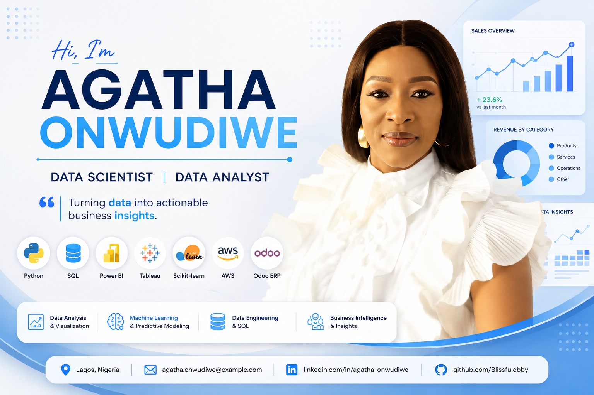

 

  

# 👋 Hi, I'm Agatha Onwudiwe

## Data Scientist | Data Analyst | Business Intelligence

Welcome to my portfolio repository.

I am a Data Scientist and Data Analyst passionate about transforming data into meaningful insights through data analytics, machine learning, and business intelligence solutions.

### Skills

🐍 Python | 🗄️ SQL | 📊 Power BI | 📈 Excel | 🤖 Machine Learning | ☁️ AWS | 📉 Data Visualization

---

## 🌐 Portfolio Website

Visit my live portfolio:

🔗 https://blissfulebby.github.io/AggiePortfolio/

---

## 📌 About This Project

This repository contains my personal portfolio website showcasing my professional journey, technical skills, analytics projects, certifications, and experience.

The portfolio highlights my work in:

- Data Analytics
- Business Intelligence
- Machine Learning
- Data Visualization
- Web-based applications

---

## ✨ Features

✅ Professional portfolio homepage  
✅ About Me section  
✅ Technical Skills showcase  
✅ Data Analytics projects  
✅ Machine Learning projects  
✅ Certifications section  
✅ Contact information  
✅ Responsive website design  

---

## 🛠 Technologies Used

### Frontend
- HTML5
- CSS3
- JavaScript

### Data Analytics & Data Science
- Python
- SQL
- Power BI
- Excel
- Tableau
- Pandas
- NumPy
- Scikit-learn

### Tools
- Git & GitHub
- VS Code
- AWS

---

## 📂 Featured Projects

### 🚗 Used Car Price Prediction

Machine learning project predicting vehicle prices using regression models.

**Tools:**
Python • Pandas • Scikit-learn • Streamlit • AWS

### 🐧 Palmer Penguins Exploratory Data Analysis

Exploratory data analysis project exploring patterns and relationships within the Palmer Penguins dataset.

**Tools:**
Python • Pandas • NumPy • Matplotlib • Seaborn

### 🦠 Stockholm Cholera Outbreak Analysis

Power BI dashboard analyzing historical mortality records to identify demographic trends and outbreak patterns.

**Tools:**
Power BI • Power Query • DAX • Data Modeling

### 🚕 NYC Taxi Trip Analysis

Power BI dashboard analyzing millions of taxi trips to discover transportation trends and business insights.

**Tools:**
Power BI • DAX • Data Visualization

---

## 🎓 Certifications

- Quantum Analytics NG — Data Analytics Professional Certification
- Regenesys Business School — Data Science Certification
- Google IT Support Professional Certificate
- IBM Customer Engagement Specialist
- SCRUMstudy by VMEdu — Scrum Fundamentals Certified (SFC™)
- Agile Scrum Master Certification
- BPA UK — Customer First Certification

---

## 📬 Connect With Me

💼 LinkedIn:  
https://www.linkedin.com/in/agatha-onwudiwe-86b87215b

🐙 GitHub:  
https://github.com/Blissfulebby

🌐 Portfolio:  
https://blissfulebby.github.io/AggiePortfolio/

---

⭐ Thank you for visiting my portfolio!
